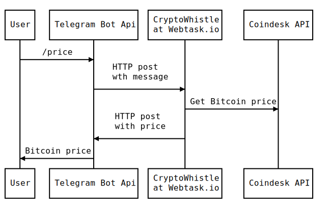

# CryptoWhistle

A telegram bot that gives you cryptocurrencies prices.

Talk to me: http://t.me/cryptowhistlebot

## How it works




### Test

Tests are built using ava.

```bash
npm test
```

## Extend

1. Talk to https://t.me/BotFather to create your bot and get a token
2. Install https://webtask.io/
3.
```bash
wt create ./src/webhook.js --secret token=<telegram_token>

curl -X POST -H "Content-Type: multipart/form-data" -F "url=<webtask_url_created> 'https://api.telegram.org/bot<telegram_bot_token>/setWebhook'
```
4. Talk to your newly created bot


## Todo
 - [ ] Organize the code as only almost everything was done I remembered that in webtask only 1 file can be uploaded ¯\_(ツ)_/¯
 - [ ] Create in place tests for the main file
 - [ ] Support multiple crypto currencies
 - [ ] Support multi language
 - [ ] Add price watchers/notification (maybe using a cron webtask?)
 - [ ] Prices per exchange
 - [ ] Price Graph?

